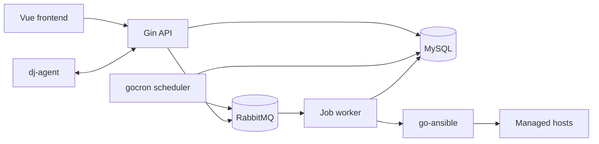

# Architecture

## Process model

One binary exposes independently deployable roles:

- `api`: Gin HTTP API, authentication, validation and domain services.
- `scheduler`: loads enabled schedules from MySQL and uses gocron only to calculate trigger times.
- `worker`: consumes durable RabbitMQ jobs and invokes domain handlers, including go-ansible.
- `migrate`: applies schema migrations after the Django baseline handoff.

The scheduler never executes long-running work. It persists an execution identity and publishes a versioned message. Workers claim the execution idempotently before running it.

## Boundaries

Each domain follows `handler -> service -> repository`. Handlers own HTTP decoding and the legacy response envelope. Services own authorization-sensitive business rules and transactions. Repositories contain handwritten SQL through generated sqlc interfaces.

Infrastructure packages must not import HTTP handlers. Domain packages may depend on small interfaces implemented by MySQL, RabbitMQ, gocron, Ansible or the agent gateway.

## Job reliability

- `execution_id` is globally unique and is the idempotency key.
- RabbitMQ messages and queues are durable; consumers use explicit acknowledgements.
- Invalid schema versions and malformed messages go directly to the dead-letter queue.
- A handler acknowledges only after its terminal state is committed to MySQL.
- Retriable failures will use a bounded retry queue with attempt metadata; business failures are terminal.
- Scheduler high availability requires a MySQL-backed leader lease before loading schedules.
- gocron singleton mode prevents overlap only inside one process and is not a distributed lock.

## Time and security

- Store and exchange timestamps in UTC; convert only at the frontend boundary using the user's timezone.
- Never put credential secrets, private keys or sudo passwords in RabbitMQ messages or logs. Messages carry database identifiers and immutable execution ids.
- Encrypt sensitive credential columns before the assets domain is migrated.
- Ansible runs as an external process. The Go binary remains CGO-free, but worker images require `ansible-core` and Python.

## Agent channel

The Django implementation keeps live gRPC agent sessions in web-process memory. The rewrite must extract this into an explicit gateway owned by one process role before automation, inspection, monitoring installation, WebSSH or file transfer traffic moves to Go. Do not reproduce hidden process-local coupling.