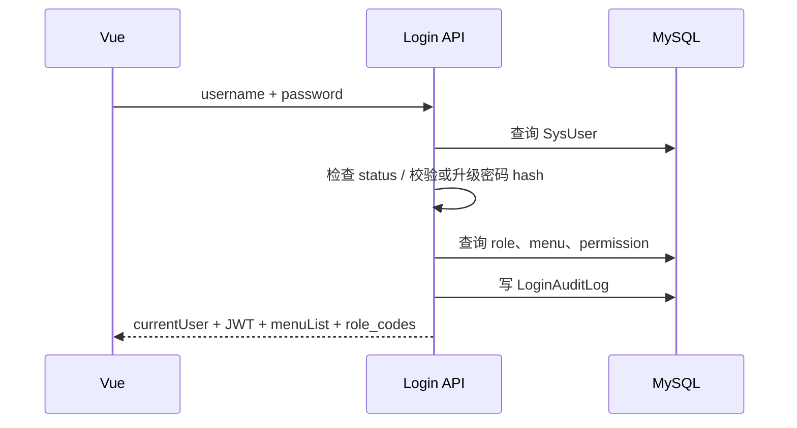
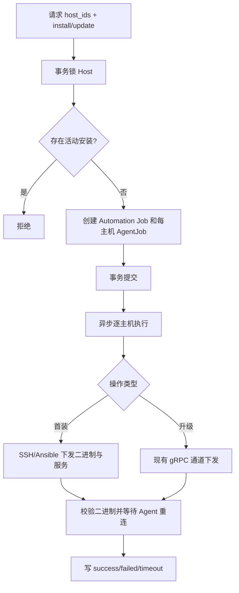
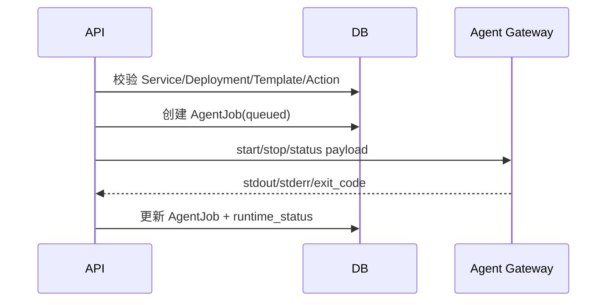
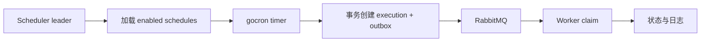

# 核心业务流程与状态机

## 1. 身份认证与 RBAC

### 登录流程



JWT 内含 perms，后续菜单权限不实时查库。因此角色/菜单变更后，旧 token 权限在过期前可能继续生效。Go 可首期保持 token contract，但应增加 token version 或短期 access token + refresh 策略。

用户角色和角色菜单都是完整集合替换：删除旧关联再批量插入。Go 必须用一个事务，输入先去重，并以 unique constraint 处理并发。

ApiToken 明文只在创建或 rotate 时返回一次，库内只存 hash。当前认证会扫描活动 token 并逐个校验，规模增大后成本线性上升；新设计应存不可逆 lookup prefix/hash ID，再执行恒定时间 secret verify。

## 2. 主机、凭证与 Agent 生命周期

### Agent 在线状态

真实在线状态来自进程内 gRPC connection registry，而不是数据库布尔值。相同 `agent_id` 重连会替换旧连接，请求按 request_id 路由等待响应。

当前 hello 只要求非空 agent_id，没有验证共享密钥。Go gateway 必须在注册连接前做 mTLS 或 per-agent token 校验，禁止未经认证的新连接驱逐旧连接。

### Agent 安装/升级



首装要求 Credential；升级要求已绑定且在线 Agent。当前 commit 后启动 daemon thread，进程崩溃会丢执行。Go 应在事务内写 execution + outbox，Worker 从 RabbitMQ 执行，并通过 execution_id 幂等 claim。

### 主机采集

采集结果包含 hardware/system/runtime/disks。静态 fingerprint 未变时避免重复写；写入时 upsert 一对一表并全量替换磁盘。批量 API 当前最多 8 线程且同步等待。

## 3. 应用拓扑与运行控制

业务链：`Project -> BusinessSystem -> ApplicationService -> ServiceDeployment -> ApplicationDeployment -> Host`。

Service 决定 application/version/template/topology/cluster profile；Deployment 表示 Host 上的实例。运行控制根据模板、macro、端口、路径、日志和 action 生成 Agent payload。



状态为 `unknown -> running|stopped|error`。start/stop 发出时先回到 unknown，status 探测才确立 running/stopped。Go 中 HTTP action 应改为返回 execution，Worker 异步执行；如果必须兼容同步 UI，可由 API 有界等待 execution 完成，但执行所有权仍属于 Worker。

Service 和 Template 是 aggregate：嵌套成员全量替换必须原子提交。提交后触发受影响主机 Fluent Bit 配置刷新。

## 4. WebSSH 与文件传输

链路为 `Browser WebSocket -> Backend session owner -> Agent gRPC -> PTY`。建立会话需要：JWT、菜单权限、Host、在线 Agent、有效 token 生命周期，以及可选 effective user 确认。

会话状态：`connected -> closed|failed`。token 到期、空闲超时、Host/连接凭证变化均可主动关闭。

终端输入输出持续追加到 WebSSHSessionLog，受最大字节配置限制并标记 truncated。文件操作还要求调用者拥有该 Host 的活动 WebSSH 会话；仅 Agent 在线不够。

文件上传先写远端临时文件，完成后原子 rename；失败 abort。下载支持 HTTP Range 206/416。Go 应让同一 Agent connection 和对应 WebSocket session 具有明确 owner，跨实例通过 gateway routing，不把 live connection 存进普通共享缓存。

## 5. Scheduler

当前 Celery Beat 每分钟扫描 due task：检查全局开关、Worker 健康、task enabled/is_running/next_run，先推进 next_run，再投递执行。执行器从硬编码函数 registry 调用维护任务、捕获进程级 stdout/stderr、写日志并按策略清理。

Go gocron 只负责计算触发，不直接执行维护函数：



多 Scheduler 需要 MySQL lease。唯一键至少覆盖 `(schedule_id, scheduled_for)`，从根上避免同一时刻重复 execution。更新任务应重新加载 gocron entry；停用应移除 entry，不依赖进程重启。

## 6. Automation Job 与 Workflow

### Job

Task/Playbook 启动时解析固定 host scope，执行预检，然后快照：Inventory、Host/Agent、Playbook 内容、extra vars、limit、run user/group、workdir、requester。

状态机：

```text
pending -> running -> success
                   -> failed
                   -> cancelled
```

执行 claim 使用条件更新 `pending -> running`，这是必须保留的正确幂等模式。每个 target 单独持久化 stdout/stderr/result，父 Job 汇总。

当前直接运行与 Task run_now 都在 HTTP 进程同步执行。Go 应创建 execution 后投递 RabbitMQ；HTTP 返回 execution_id。go-ansible 只在 Worker 中调用，临时 inventory/key/playbook 需要受控目录、权限 0600 和退出清理。

### Controller SSH Key

事务 + 行锁保证全局 key 初始化，private key 可逆加密。执行前先经在线 Agent 安装 public key，再由 Worker 上的 ansible-playbook SSH 到目标。密钥轮换需要双 key 过渡或明确停机窗口。

### Workflow

Workflow 当前是线性图，允许 task node 和 nested workflow。启动时快照 nodes/edges/defaults；运行时每次推进一个 ready node，并阻止递归祖先。

WorkflowRun 没有独立 cancelled status：取消表现为父状态 failed，`result_summary.cancelled=true`，等待节点 skipped，活动 Job DB 状态 canceled。首期应兼容该输出；内部 Go 状态建议有 `cancel_requested/cancelled`，adapter 再映射旧 API。

取消目前通常不终止远程 Ansible。新实现需区分：请求取消、Worker 已观察、子进程 SIGTERM/SIGKILL、Agent 确认、最终 cancelled。

## 7. Inspection

目标范围：

- `per_host`：固定 selected_host_ids。
- `per_deployment`：每个部署执行。
- `service_once`：HA 服务先探测 VIP owner，只选一个成员。

启动事务创建 execution 和 targets，commit 后进程内线程池执行。检查可在 Agent 或 Controller 执行，executor 为 shell/schema_validate/http/tcp。

状态层次：

```text
Execution: pending -> running -> success|failed|canceled
Target:    pending -> running -> success|failed|canceled
Check:     pass|fail|error|skipped
```

warning fail 只增加 warning count，不导致 target failed；critical fail 才失败。无 Agent 的主机按业务可 skipped，已安装但离线则失败。

执行后按 task/target fingerprint 维护 Inspection 来源告警：持续异常刷新同一 firing，恢复时 resolved，取消不发告警。

## 8. Exporter、Fluent Bit 与日志管理

MonitorTarget 的 `managed_enabled` 是期望状态：首次 true 安装，true→false 卸载，不变不重复下发。安装包按 Host OS family/version/architecture 选择，Playbook 以 root 执行但服务可使用非 root 身份。

安装状态：

```text
Target:  unknown -> pending -> success|failed
History: pending -> running -> success|failed|cancelled
```

cancel 当前只解除本地状态，不保证停止远端工作。每个 target/log target 必须限制最多一个 active operation。

Fluent Bit 配置由 Service/Template/LogDefinition/override 生成，计算 fingerprint；相同则 skipped，不同则原子写文件、清理 stale fragment，再 reload/start。这是应保留的幂等机制。

OpenSearch bootstrap upsert template 与 ISM policy，policy 更新使用 seq_no/primary_term 乐观锁。ProcessingRule 当前先改远端 pipeline 再写 DB，可能出现跨系统分叉；Go 应写 desired state + outbox，由 reconciler 达成最终一致。

## 9. 告警与通知

Prometheus webhook 对排序 labels 计算稳定 SHA-1 fingerprint：

- 新异常创建 firing。
- 重复 firing 更新 last_seen 和快照。
- `endsAt <= now` 转 resolved。
- reconciliation 解决 Prometheus 已消失的 active alert；inspection 来源排除。

`AlertHistory.fingerprint` 目前只有 index 无 unique，并发 webhook 可能创建重复 firing。Go 应建立 current alert 唯一身份或在事务中行锁/upsert。

通知以 `(alert,event_type)` dedupe，再为每个 `(event,media,user,address)` 建 Delivery：

```text
pending -> sending -> success
                   -> failed -> bounded retry
```

收件人来自 UserAlertMediaBinding.recipients。Route matcher 当前是 label exact match；firing/resolved 分别控制是否通知。

## 10. 审计和保留

登录审计记录每次成功/失败。操作审计只记录 authenticated mutation，存 actor、route、request/response、status、duration；敏感字段必须在写入前递归脱敏。

独立保留策略包括：WebSSH 约 30 天、Automation/Workflow 约 30 天、Audit 约 90 天、Inspection 约 90 天、Monitor install 约 180 天并保留每目标最新记录、resolved alert 约 90 天，firing alert 不清理。具体值最终来自 SysConfig，不应硬编码在 Worker。