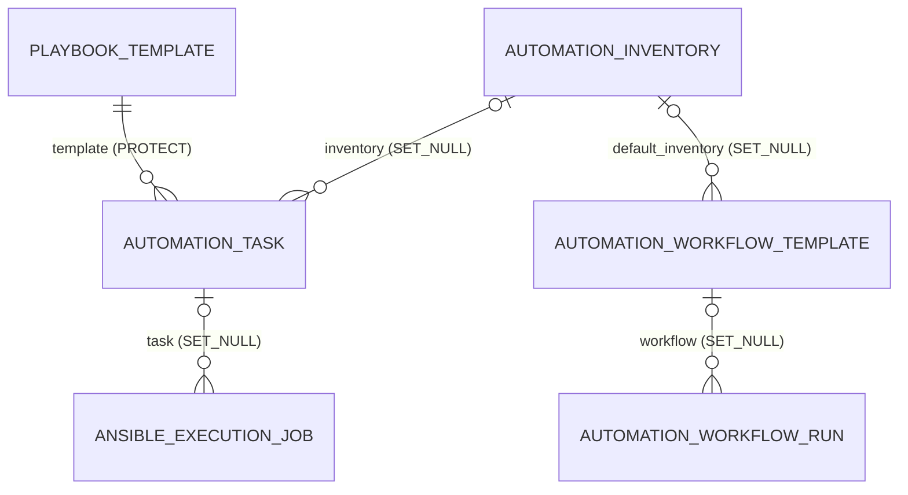

# Automation Model 关联关系

## ER 关系图

## 关联清单

- PlaybookTemplate -> AutomationTask

  - 字段: `AutomationTask.template`
  - 基数: 一对多
  - on_delete: `PROTECT`
  - related_name: `tasks`
- AutomationInventory -> AutomationTask

  - 字段: `AutomationTask.inventory`
  - 基数: 一对多（可空）
  - on_delete: `SET_NULL`
  - related_name: `tasks`
- AutomationTask -> AnsibleExecutionJob

  - 字段: `AnsibleExecutionJob.task`
  - 基数: 一对多（可空）
  - on_delete: `SET_NULL`
  - related_name: `jobs`
- AutomationInventory -> AutomationWorkflowTemplate

  - 字段: `AutomationWorkflowTemplate.default_inventory`
  - 基数: 一对多（可空）
  - on_delete: `SET_NULL`
  - related_name: `workflows`
- AutomationWorkflowTemplate -> AutomationWorkflowRun

  - 字段: `AutomationWorkflowRun.workflow`
  - 基数: 一对多（可空）
  - on_delete: `SET_NULL`
  - related_name: `runs`

## 说明

- `AutomationTask.selected_host_ids`、`AutomationTask.selected_group_ids`、`AutomationInventory.selected_host_ids`、`AutomationInventory.selected_group_ids`、`AutomationWorkflowTemplate.nodes`、`AutomationWorkflowTemplate.edges`、`AutomationWorkflowRun.node_results` 等为 JSON 字段，不是数据库级外键关系。

## 历史

- **v2 之前**: 主链路为 Job → Target → Event；主机状态由 target 表承载，详细日志由 event 表贮存。
- **v2** (当前): 主链路简化为 Job + inventory_snapshot；job 级状态基于 `run_result.status` 或用户设置，消除了 Target 模型；主机级汇总从 inventory_snapshot 推导，不再需要 event 表。
