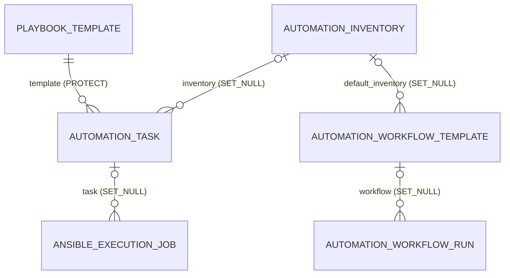

# Automation Model 关联关系

## ER 关系图

```mermaid
erDiagram
    PLAYBOOK_TEMPLATE ||--o{ AUTOMATION_TASK : "template (PROTECT)"
    AUTOMATION_INVENTORY o|--o{ AUTOMATION_TASK : "inventory (SET_NULL)"

    AUTOMATION_TASK o|--o{ ANSIBLE_EXECUTION_JOB : "task (SET_NULL)"

    AUTOMATION_INVENTORY o|--o{ AUTOMATION_WORKFLOW_TEMPLATE : "default_inventory (SET_NULL)"
    AUTOMATION_WORKFLOW_TEMPLATE o|--o{ AUTOMATION_WORKFLOW_RUN : "workflow (SET_NULL)"
```

## 关联清单

- PlaybookTemplate -> AutomationTask

  - 字段: `AutomationTask.template`
  - 基数: 一对多
  - on_delete: `PROTECT`
  - related_name: `tasks`
- AutomationInventory -> AutomationTask

  - 字段: `AutomationTask.inventory`
  - 基数: 一对多（可空）
  - on_delete: `SET_NULL`
  - related_name: `tasks`
- AutomationTask -> AnsibleExecutionJob

  - 字段: `AnsibleExecutionJob.task`
  - 基数: 一对多（可空）
  - on_delete: `SET_NULL`
  - related_name: `jobs`
- AutomationInventory -> AutomationWorkflowTemplate

  - 字段: `AutomationWorkflowTemplate.default_inventory`
  - 基数: 一对多（可空）
  - on_delete: `SET_NULL`
  - related_name: `workflows`
- AutomationWorkflowTemplate -> AutomationWorkflowRun

  - 字段: `AutomationWorkflowRun.workflow`
  - 基数: 一对多（可空）
  - on_delete: `SET_NULL`
  - related_name: `runs`

## 说明

- `AutomationInventory.selected_host_ids`、`AutomationWorkflowTemplate.nodes`、`AutomationWorkflowTemplate.edges`、`AutomationWorkflowRun.node_results` 等为 JSON 字段，不是数据库级外键关系。

### 执行范围语义

- **Inventory 是执行范围的唯一来源**。`AutomationTask.run_now` / `precheck` 与 Workflow 启动都强制要求任务绑定 Inventory，未绑定直接拒绝执行。
- `AutomationInventory.selected_host_ids` **只存固定主机 ID 列表**。前端勾选分组只是批量勾选入口，保存时展开成具体主机；此后往该分组新增主机**不会**自动进入已有 Inventory，需要重新勾选。
- 因为范围是 JSON 字段而非外键，主机组删除时没有数据库级 `PROTECT`。`assets` 侧的主机组单删/批删会显式检查「待删分组子树内的主机 ID」是否被 Inventory 或巡检任务引用，命中则拒绝删除。

## 历史

- **v2 之前**: 主链路为 Job → Target → Event；主机状态由 target 表承载，详细日志由 event 表贮存。
- **v2**: 主链路简化为 Job + inventory_snapshot；job 级状态基于 `run_result.status` 或用户设置，消除了 Target 模型；主机级汇总从 inventory_snapshot 推导，不再需要 event 表。
- **v3** (当前): 执行范围收敛为固定主机 ID。移除 `AutomationInventory.selected_group_ids`（迁移 `0049`，勾选分组按子树展开固化成主机 ID），并删除从不参与执行的 `AutomationTask.selected_host_ids` / `selected_group_ids`（迁移 `0050`）。`run_now`、`precheck`、`inventories/{id}/precheck-limit/`、`playbooks/{id}/run/` 均不再接受 `group_ids` 入参。
