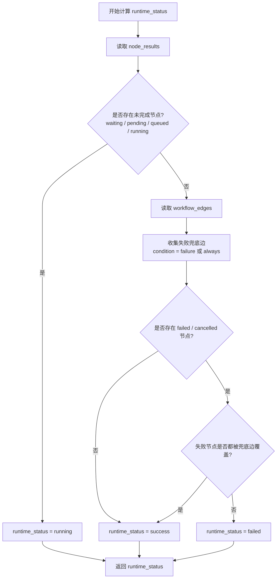

# Workflow 后端实现说明

适用范围：

- backend/djadmin/automation/models.py
- backend/djadmin/automation/serializer.py
- backend/djadmin/automation/views.py
- backend/djadmin/automation/urls.py

本文聚焦当前代码实现，不描述历史版本。

## 1. 数据模型

### 1.1 AutomationWorkflowTemplate

- 作用：保存 workflow 模板定义。
- 关键字段：
  - name, description, enabled
  - nodes: 节点数组
  - edges: 连线数组
  - default_extra_vars
  - entry_node_key: 兼容字段，当前运行时不再依赖

### 1.2 AutomationWorkflowRun

- 作用：保存一次 workflow 运行实例。
- 关键字段：
  - workflow, status, trigger_type
  - node_results: 运行中各节点状态
  - result_summary: 运行摘要与快照
  - start_time, end_time, duration_seconds

## 2. Graph 结构约定

### 2.1 节点 nodes[]

- 公共字段：
  - key, name, node_type, convergence, x, y
- node_type 支持：
  - task: 必须包含 task_id
  - workflow: 必须包含 workflow_id

### 2.2 连线 edges[]

- 字段：source_key, target_key, condition
- condition 支持：success, failure, always

### 2.3 校验规则

validate_workflow_graph_or_raise 会做以下校验：

- nodes/edges 类型合法
- key 唯一
- node_type 与字段匹配
- task_id/workflow_id 指向对象存在
- edges 指向节点存在
- condition 取值合法
- 图为 DAG（禁止环）

说明：

- 当前允许 workflow 节点引用当前模板自身。
- 递归拦截在运行时执行，不在保存阶段阻止。

## 3. API 总览

路由注册位于 urls.py：

- workflows/
  - GET list
  - GET detail
  - POST create
  - PATCH update
  - DELETE destroy
  - POST preview
  - POST launch
- workflow-runs/
  - GET list
  - GET detail
  - POST cancel

## 4. 启动与执行

### 4.1 launch 流程

AutomationWorkflowTemplateManage.launch 主要步骤：

1. 校验模板可启动（enabled）
2. 生成 execution_plan
3. 创建 AutomationWorkflowRun
4. 写入 node_results 初始状态（waiting）
5. 写入 result_summary 快照：

- workflow_nodes_snapshot
- workflow_edges_snapshot
- workflow_ancestor_template_ids（初始化为当前 workflow.id）

6. 调用 _refresh_workflow_run_progress 推进运行

补充说明：

- workflow 运行图按树形理解：从左到右展开。
- 同一层节点按从上到下的顺序进行调度观察与展示。

### 4.2 节点派发

_refresh_workflow_run_progress 按层推进，识别可运行节点并派发：

- task 节点：调用 _dispatch_workflow_task_job
  - 创建 AnsibleExecutionJob
  - 异步投递 execute_ansible_job_task
- workflow 节点：调用 _dispatch_workflow_child_run
  - 创建子 AutomationWorkflowRun
  - 将 child_run_id 回写到父节点结果

## 5. 运行时递归检测

递归检测逻辑位于 _dispatch_workflow_child_run：

1. 读取当前 run 的祖先模板链 workflow_ancestor_template_ids
2. 将目标 workflow_id 与祖先链比对
3. 命中则拒绝派发，返回失败信息

失败消息格式：

- Recursion detected (spawn order, most recent first): ...

效果：

- 该节点被标记 failed
- 不创建子 run，不投递后续执行
- 错误原因写入节点 message，供前端展示

## 6. 节点状态机

node_results[].status 主要状态：

- waiting: 前置条件未满足
- pending: 已满足条件但本轮未派发
- queued: 已派发等待任务接管
- running: 执行中
- success: 成功
- failed: 失败
- cancelled: 取消
- skipped: 已跳过（条件不满足）

### 6.1 Job/子 run 回写

- task 节点依据 job_id 读取作业状态并映射到节点状态
- workflow 节点依据 child_run_id 读取子 run 状态并映射到节点状态
- 前端运行图中节点名称右侧显示的 `耗时 00:00:00` 是节点耗时，表示从开始执行到当前时刻或结束时刻的累计耗时

### 6.2 convergence 规则

convergence 支持 any 与 all：

- all：所有父边条件匹配才可运行
- any：任一父边条件匹配即可运行
- 父节点均终态且仍不匹配时，节点标记 skipped

### 6.3 调度节奏

- 按最浅未完成层推进
- 同层存在 running/queued 时，不再派发新节点
- 同层 ready 节点按从上到下顺序进入候选
- 每轮只派发 1 个节点，其余 ready 标记 pending
- 运行顺序的直观展示遵循树形排布：左到右分层，同层从上到下。

## 7. Run 状态聚合

说明：这里说的 workflow 状态，实际指 AutomationWorkflowRun.runtime_status 的聚合结果，不是简单把所有节点状态直接合并。

规则（AWX 风格）：

1. 存在未完成节点（waiting/pending/queued/running）-> running
2. 若存在未处理失败（failed/cancelled 且无 failure/always 出边兜底）-> failed
3. 其他已结束场景 -> success

### 7.1 详细计算流程

补充说明：

- 节点未结束时，run 一定先显示 running。
- 只有所有节点都结束后，才进入失败/成功聚合。
- failed / cancelled 节点如果有 failure 或 always 分支承接，run 最终仍可视为 success。
- 如果没有 node_results，运行态会回退为 run 自身的 status 字段。

## 8. 取消语义

workflow-runs/{id}/cancel/ 行为：

- 取消当前 run 下可取消的 task 作业
- 对对应节点标记 cancelled
- 当前 run 的 result_summary 记录 cancelled=true
- 再次触发 _refresh_workflow_run_progress 做最终状态聚合

## 9. 关键约束与兼容说明

- entry_node_key 仅保留兼容，不再作为执行入口。
- 运行时使用 result_summary 中的 graph snapshot，避免模板后续修改影响历史运行。
- workflow 节点允许自引用保存，但运行时会被祖先链递归检测拦截。
